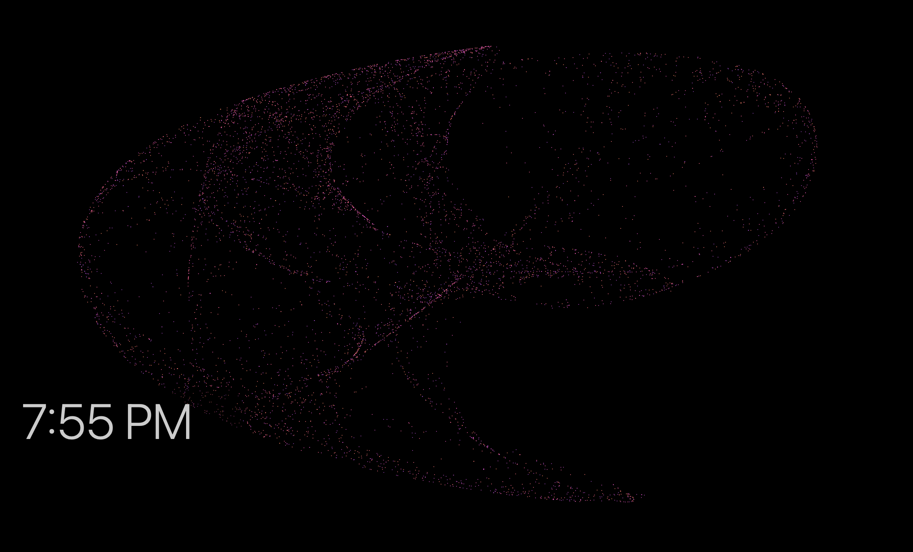
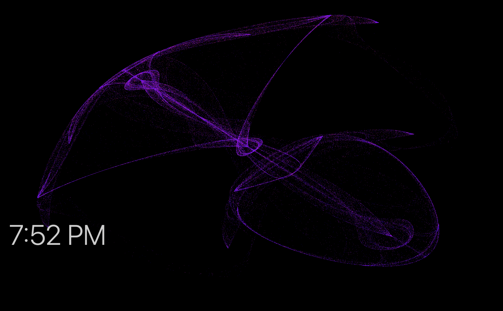

# de Jong Attractor

Mac screensaver based off of [Mike Bostock's de Jong Attractor II](https://observablehq.com/@mbostock/de-jong-attractor-ii). 

The initial reimplementation in pure swift is in the pure_swift folder. It cannot handle much more than 2^13 points (on an M1 MacBook Air). 

The implementation in Metal (the Apple shader language) is in the metal folder. This handles many more points on the order of 2^18 points. 

