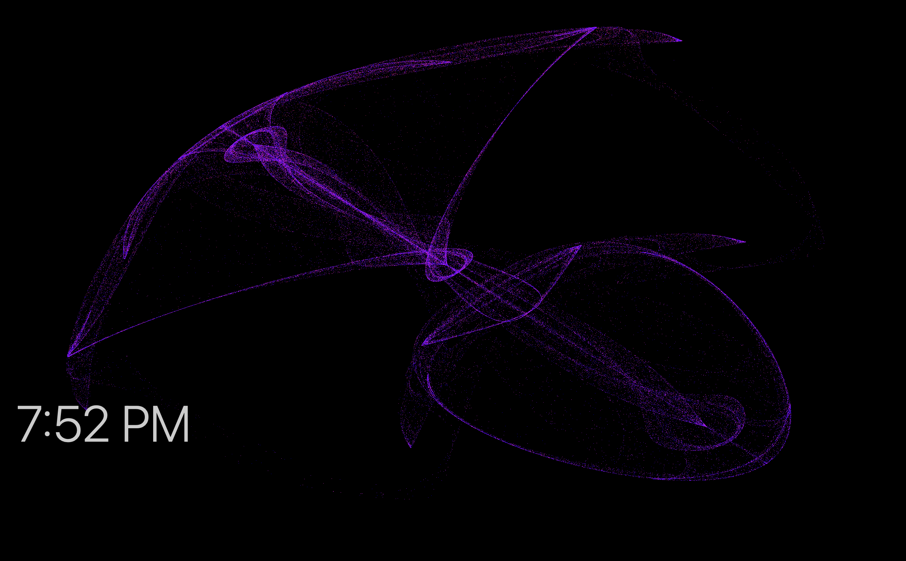
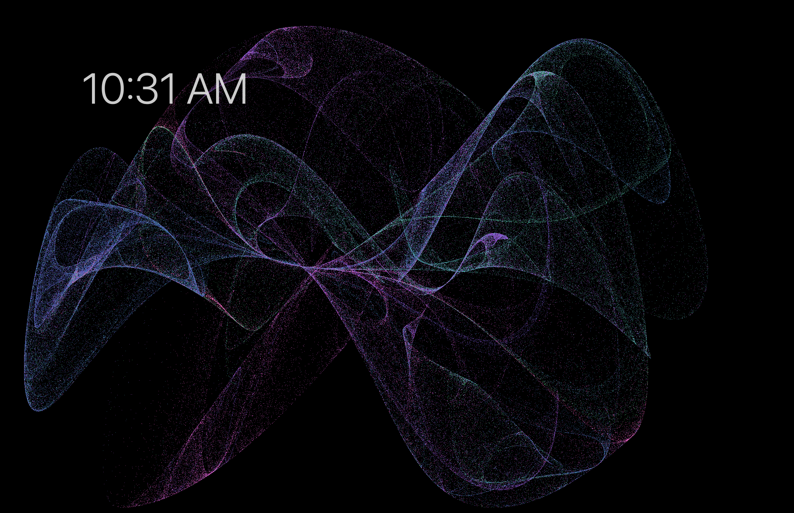

# de Jong Attractor

Mac screensaver based off of [Mike Bostock's de Jong Attractor II](https://observablehq.com/@mbostock/de-jong-attractor-ii). 

The initial reimplementation in pure swift is in the pure_swift folder. It cannot handle much more than 2^13 points (M1 MacBook Air). 

The implementation in  Objective C and Metal (the Apple shader language) is in the c_metal folder. This handles many more points on the order of 2^18 points. 

The implementation in Swift and Metal is in the swift_metal folder. This differs in the coloring scheme and has certain colors overlapping due to the color being based on initial position rather than transformed position. This can also handle points on the order of 2^17 or 18. 

